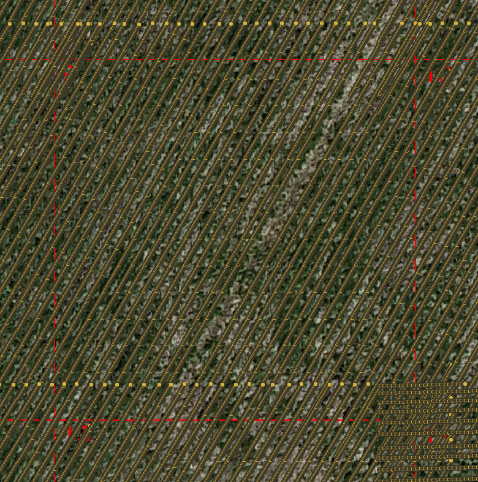

.. _tutorial-test-data:

Tutorial with Test Data
=======================

In this tutorial, we will guide you through the steps to run *crop-row-connector* using the provided test data.

The dataset includes two main files found in the `test_dataset/input/` directory:
- A csv file containing the GPS coordinates of the crop rows. (`row_information_global.csv`)
- A csv file containing the GPS coordinates of all points in the orthomosaic. (`points_in_rows.csv`)

A visual representation of all the points in the orthomosaic can be seen below:

    detected crop rows in an orthomosaic.

The orthomosaic from which the test data is derived can be found in the `test_dataset/` directory as `orthomosaic_test_data.tif`, and can be viewed using georeference tools like QGIS.

if *crop-row-connector* is not already installed, see :doc:`installation </installation>`.

With *crop-row-connector* installed the CLI can be run with:

.. code-block:: shell

    python -m crop-row-connector

or if the installation have added *crop-row-connector* to the path it can be invoked simply with:

.. code-block:: shell

    crop-row-connector

From here on out we will assume *crop-row-connector* is in the path, but if that is not the case for you replace :code:`crop-row-connector` in the following with :code:`python -m crop-row-connector`.

Use the following command to run the *crop-row-connector* on the test data.

.. code-block:: shell

    crop-row-connector \
    test_dataset/input/row_information_global.csv \
    test_dataset/input/points_in_rows.csv \
    --distance_tolerance 0.12 \
    --angle_tolerance 0.12 \
    --output_path_connected_crop_rows test_dataset/output/connected_crop_rows.csv \
    --output_path_vegetation_points test_dataset/output/line_points.csv \
    --output_path_unhealthy_vegetation_segments test_dataset/output/unhealthy.shp \
    --output_path_healthy_vegetation_segments test_dataset/output/healthy.shp

After running the command, you will find the output files in the specified paths. You can visualize the connected crop rows and line points using georeference tools like QGIS.
